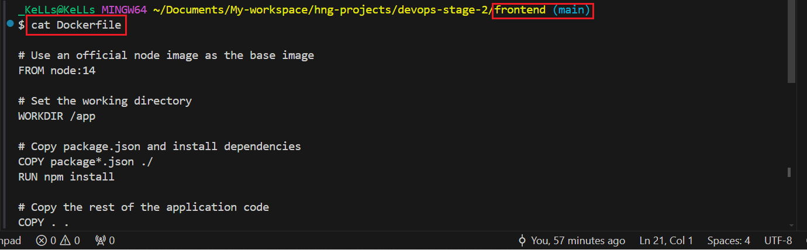
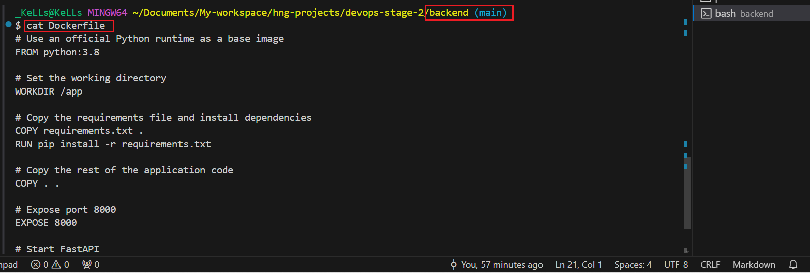
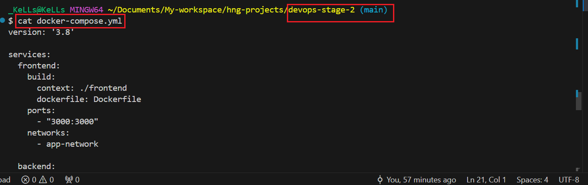

# Full-Stack FastAPI and React Template

Welcome to the Full-Stack FastAPI and React template repository. This repository serves as a demo application for interns, showcasing how to set up and run a full-stack application with a FastAPI backend and a ReactJS frontend using ChakraUI.

## Project Structure

The repository is organized into two main directories:

- **frontend**: Contains the ReactJS application.
- **backend**: Contains the FastAPI application and PostgreSQL database integration.

Each directory has its own README file with detailed instructions specific to that part of the application.

## Getting Started

To get started with this template, please follow the instructions in the respective directories:

- [Frontend README](./frontend/README.md)
- [Backend README](./backend/README.md)

**Dockerfiles:**

- Defines the environment and dependencies for both the frontend and backend of the appliation.

**Docker Compose:**

- Simplifies the process of starting, stopping,managing networking between different services so the application can communicate with each other.

